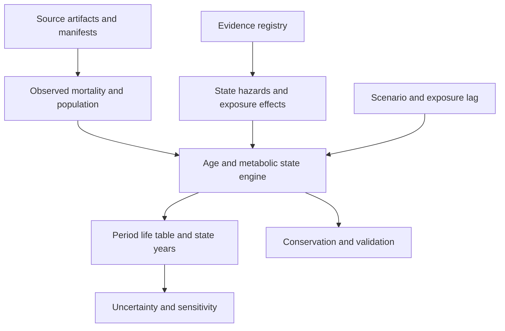

# Demeter

**Demeter is an open-source project from [Food is Health](https://foodishealth.substack.com/) to model the market dynamics connecting food, agriculture, health, and capital.**

The project translates questions explored in the Food is Health Substack into explicit causal relationships, auditable evidence, and reproducible scenarios. Its long-term purpose is to show where change can influence the system, what constrains that change, who benefits, and how strategic options gain or lose value as key trends shift.

[Why Demeter](docs/WHY_DEMETER.md) brings together the project's purpose, the
stories behind its name, its approach to software, and the invitation to contribute.

Demeter is intended for **participants at every stage of the value chain** to see
how a change they make creates value elsewhere, and what allows them to capture
a share. For example, a producer adding a regenerative practice should be able
to investigate how its effects reach retail and how any added value flows back
through prices, costs, and contracts.

The flagship future exercise is a **shift toward real food**. It should reveal
the levers connecting agriculture, food, and health, with particular attention
to whether earlier intervention in the **PreChronic** population can reduce net
healthcare costs. See [the scenario brief](docs/REAL_FOOD_VALUE_CHAIN.md) for the
actors, pathways, required definitions, and evidence still needed.

The [model-design inputs](docs/design/README.md) turn that purpose into a
causal-loop table, positive/negative externality registers, required input
packages, and formulation/validation contracts. Proposed loops remain labeled
premises until their evidence, equations, and applicability are established.

Food prices, treatment access, consumer behavior, production costs, and reimbursement can change together. Demeter aims to trace those changes through food demand, supply, metabolic health, healthcare economics, and the incentives that feed back into the market. The model must be able to challenge a Food is Health hypothesis as well as support it.

**New here?** [Purpose and staged roadmap](docs/START_HERE.md) · [Install on macOS, Linux, or Windows](docs/GETTING_STARTED.md) · [First exercise](docs/FIRST_EXERCISE.md) · [Learning path and notebook](docs/LEARNING_PATH.md) · [Data and source archive](data/README.md) · [Contribute](CONTRIBUTING.md)

Think of Demeter as a **management flight simulator built in stages**: form a
hypothesis, try an intervention, inspect delays and consequences, and improve
your understanding. The learning approach is inspired by John Sterman and MIT's
[management flight simulators](https://mitsloan.mit.edu/faculty/academic-groups/system-dynamics/courses-and-programs).
Demeter is an independent project; the current health engine is the first stage
of that larger ambition. Each new mechanism must earn its place through evidence
and validation.

You can help before the whole system exists. Improve one source, test one causal
link, explain a real constraint, or tell us where a first-time reader gets lost.
The goal is progressively better analysis, including results that challenge the
Food is Health thesis. Current dietary scenario outputs remain **validation-only**.

**Explore further:** [Public guide](docs/wiki/Home.md) · [Top-level metrics](docs/wiki/Top-Level-Metrics.md) · [Stakeholder rigidities](docs/wiki/Stakeholder-Rigidities.md) · [Related work](docs/RELATED_WORK.md) · [Levers and scenarios](docs/wiki/Levers-and-Scenarios.md) · [Real options](docs/wiki/Real-Options-and-Strategic-Value.md) · [Tornado diagrams](docs/wiki/Visualization-and-Tornado-Diagrams.md) · [Model status](docs/V0_1_STATUS.md)

## What Demeter is intended to reveal

Researchers can now use the [module API](docs/MODULE_API.md) to supply explicit
health-transition equations from Python or the CLI. Typed exchanges validate
units, labelled shapes, timing and evidence dependencies; examples reproduce the
canonical model or run a no-diet-effect alternative. Broader module contracts
are documented without activating later-phase models.

The [local extension registry](docs/EXTENSIONS.md) adds versioned scenario/module
packages with authors, licenses, compatibility and file checksums. Explicitly load
community alternatives, inspect their evidence, and compare existing health
structures while retaining each run's provenance. Registration does not import
code or approve clinical claims.

The [food-leverage report](docs/LEVERAGE.md) now explains modeled healthspan and
T2D-entry changes through explicit dietary hazard pathways. It includes paired
sensitivity, sampling intervals, evidence status and historical context, with
offline plots and machine-readable output. This explains current software
behavior; it does not establish calibrated food-policy findings.

The optional [GLP-1 experiment](docs/GLP1.md) now models eligibility, access,
capacity, treatment persistence, interruption, restart and response/washout in
joint health stocks. Its [example scenario](scenarios/glp1_access.yaml) is
validation-only. Official ClinicalTrials.gov JSON records ship in the repository
as reloadable benchmarks; clinical effects and population transport remain
uncalibrated.

| Question | Intended analysis |
| --- | --- |
| Which changes matter most? | Trace a controllable lever through adoption, substitution, delays, health effects, and economic feedback. |
| What prevents change? | Locate constraints in affordability, consumer persistence, evidence, reimbursement, supply, or capital. |
| What if a major trend changes? | Compare slow, fast, stalled, and reversing paths for food prices, GLP-1 access, prevention adoption, and production economics. |
| Who receives the value? | Separate health gains, household spending, payer savings, provider economics, farm income, and enterprise cash flows. |
| What is worth keeping open? | Compare committing now with piloting, waiting, expanding, switching, or exiting as new information arrives. |

For example, a producer and retailer could compare a pilot for a specified
regenerative product with committing to larger capacity. Demeter should eventually
show how repeat purchases, a possible premium, verification and distribution costs,
and procurement terms affect each party's return. Any health benefit requires its
own evidence; neither a practice label nor a retail premium establishes one.

These market and real-options capabilities are **planned research directions**. The current release establishes a narrower health-model foundation; it does not yet value businesses, forecast food markets, or estimate validated dietary health effects.

Tornado diagrams are a planned core diagnostic: rank how much specified changes in each input move an outcome, show direction and uncertainty ranges, and connect each bar to its causal path and evidence. Decision-focused versions should show which assumptions change the relative value of acting, waiting, expanding, or exiting. These charts describe model sensitivity; causal interpretation depends on the underlying evidence.

## An open project under Food is Health

The [Substack](https://foodishealth.substack.com/) is the home for the broader conversation. This repository is the home for inspectable code, evidence, assumptions, and model revisions. Readers, researchers, operators, clinicians, economists, and developers can help turn a thesis into a testable question, supply evidence, or identify a missing mechanism.

Demeter is released under the [MIT License](LICENSE). Contributions should preserve reproducibility, document uncertainty, and make disagreement testable. Anyone can propose a pull request; Carter Williams ([@jcarterwil](https://github.com/jcarterwil)) reviews and merges community changes. See [contributing](CONTRIBUTING.md) and [governance](GOVERNANCE.md).

## Project vision

The program vision and phased roadmap are documented in [docs/PROJECT_VISION.md](docs/PROJECT_VISION.md). The mature module/runtime architecture is in [docs/SYSTEM_ARCHITECTURE.md](docs/SYSTEM_ARCHITECTURE.md), and the long-term scenario surface is preserved in [docs/SCENARIO_CATALOG.md](docs/SCENARIO_CATALOG.md).

Demeter is designed as a hybrid system: system dynamics for aggregate stocks/flows and feedback loops, with agent-based modeling added selectively where heterogeneous behavior matters. Canonical naming is **Demeter** for the project/model, **Demeter Model** for the scientific model, and **Demeter Simulator** for the eventual interactive application. The scientific model remains locally reproducible; Codex Cloud is used for bounded autonomous engineering; Vercel is reserved for a later interactive interface rather than the core model runtime.

## North-star questions

Demeter is ultimately intended to identify **system leverage**: which upstream changes materially alter downstream health and economic outcomes, through what pathways, with what delays, feedbacks, and uncertainty.

Examples include:

- How does consumer price elasticity for higher-quality food affect dietary behavior and type 2 diabetes incidence?
- How do commodity-crop economics and processing scale create cheap calories relative to nutrient-dense food?
- How does nutrient density affect taste, satiety, food choice, and metabolic outcomes?
- Which links between agricultural practice, soil health, food composition, and chronic disease are strongly evidenced versus merely hypothesized?
- Under what conditions could regenerative or other production practices materially reduce chronic-disease burden?
- Which intervention points have the largest downstream impact per dollar, per acre, or per unit of behavioral change?
- Where do delays, reinforcing loops, balancing loops, and bottlenecks dominate the system?

These are research questions, not assumptions. Demeter should make the intermediate causal links explicit and allow the evidence and sensitivity analysis to determine which levers are material.

## Current status: v0.1.0a1 engineering build

The CLI and age-structured engine work with observed U.S. mortality and population inputs. **The scientific v0.1 release is not complete.** Metabolic-state allocation, transition hazards, mortality hazard ratios, dietary effect and lag still use clearly labeled synthetic inputs. The program refuses scientific mode until those gaps are resolved. No diet-induced lifespan result is a finding.

Implemented:

- 101 single-age/open-age cohorts (0–99, 100+), with total/male/female runs.
- CDC/NCHS 2022–2024 mortality schedules and Census Vintage 2025 age counts for those years.
- Three population-conserving metabolic states; explicit deaths, aging, and zero births/migration.
- Independent period life tables, plus a Sullivan-style measure of years in the modeled healthy state.
- Evidence registry, source checksums, dose-envelope checks, lags, and provenance on every simulation.
- Scenario comparison, paired Monte Carlo uncertainty, SALib Sobol sensitivity, prevalence discrepancy report, and historical mortality persistence backtest.
- Versioned source datasets and official JSON links, plus an offline NHANES age/sex glycemic-prevalence reconstruction with survey uncertainty.

See [acceptance status](docs/V0_1_STATUS.md), [model specification](docs/MODEL_SPEC.md), and [evidence gaps](docs/EVIDENCE_GAPS.md).

For versioned results, use the [release and replay workflow](docs/RELEASES.md).
It captures exact source/data bytes, canonical outputs, uncertainty, historical
diagnostics and a model card while retaining the alpha's scientific limitations.

## Run locally or in Codex Cloud

For a first installation, follow the [platform-specific setup guide](docs/GETTING_STARTED.md).
For the optional [educational Explorer](docs/EXPLORER.md), install Node.js 24 and run:

```text
uv run --extra studio demeter explore
```

One command builds the Next.js interface, starts a local Python service and opens
the browser. Explore charts alongside explanations, change assumptions, compare
saved experiments, and export offline reports. Current results remain validation-only.

The existing CLI and offline reports need no server, database, API key, or paid tool.
uv uses the pinned
Python 3.12 environment; Python 3.11 is also exercised in CI. Once cloned, run from
the repository root:

```text
uv sync --locked
uv run demeter validate
uv run demeter observe scenarios/reduce_upf_30.yaml --draws 4 --samples 8 --seed 42
```

Open `outputs/observability/index.html`: use `open` on macOS, `xdg-open` on Linux,
or `Start-Process .\outputs\observability\index.html` in Windows PowerShell.
The small sample counts are for a first look at the tools. Continue with the
[guided exercise](docs/FIRST_EXERCISE.md).

Additional analysis and contributor commands:

```bash
uv sync --locked
uv run demeter validate
uv run demeter evidence audit
uv run demeter evidence applicability
uv run demeter evidence healthspan
uv run demeter healthspan scenarios/baseline.yaml --output outputs/healthspan.json
uv run demeter simulate scenarios/baseline.yaml --output outputs/baseline.json
uv run demeter simulate scenarios/reduce_upf_30.yaml --output outputs/reduce_upf_30.json
uv run demeter compare scenarios/baseline.yaml scenarios/reduce_upf_30.yaml
uv run demeter uncertainty scenarios/reduce_upf_30.yaml --draws 128 --seed 42
uv run demeter sensitivity life_expectancy --samples 64 --seed 42
uv run demeter backtest --train-year 2022 --holdout-year 2023
uv run python -X utf8 -m pytest
uv run ruff check .
```

Commands emit readable JSON. Ordinary runs and tests are offline after installation. `validate` exits successfully when software/data checks pass, while reporting `scientific_release_ready: false`. `validate --scientific-required` deliberately exits with code 1 for this alpha.

Contributors can [save and check model parity](docs/MODEL_PARITY.md) across code
changes. The offline check covers six scenarios, complete cohort/life-table/flow
outputs and fixed-seed uncertainty, retaining both revisions' provenance.
Unchanged software behavior is separate from clinical validation.

For more stable Sobol estimates, increase `--samples` to 256 or 1024 and inspect the reported confidence half-widths. Small sample runs are tests of the analysis pipeline, not reliable rankings.

## Architecture



Core equations use transparent NumPy arrays. BPTK-Py remains available for later feedback/delay modules; the age-shift and life-table operations are easier to inspect directly. There is no database or hosted runtime dependency. See [the engine decision](docs/ENGINE_DECISION.md).

## Source data travel with the model

The repository contains 53 public source files: baseline and historical inputs,
NHANES survey files, official JSON snapshots, and the NCHS healthspan method
reference, plus the derived bundles. The [frozen mortality evaluation](docs/MORTALITY_VALIDATION.md)
adds a reproducible reserved-cycle prediction check without changing active health parameters. See the
[data catalog and contribution policy](data/README.md) for locations, source terms,
and the distinction between raw observations, derived inputs, and assumptions.
The [observation-to-state audit](docs/OBSERVATION_STATE_MAPPING.md) explains how
survey categories relate to model stocks, including unclassified people and
unsupported substitutions. Reproduce it with `uv run demeter evidence state-mapping`.
The optional [joint glycemic uncertainty report](docs/JOINT_GLYCEMIC_UNCERTAINTY.md)
retains category and cross-domain sampling dependence, including unknowns and
partial-membership endpoints. It advances observed initialization uncertainty
without allocating clinical states.
Verify the archive and reproduce the bundles without network access or changes
to committed files:

```bash
uv run python scripts/verify_source_archive.py --rebuild
uv run demeter data verify-store
uv run demeter data rebuild-nhanes --destination outputs/nhanes-rebuilt
uv run demeter data rebuild-healthspan --destination outputs/healthspan-rebuilt
uv run demeter data rebuild-dietary --destination outputs/dietary-rebuilt
uv run demeter food-exposures --output outputs/food-exposures.json
uv run demeter evidence population --output outputs/population-evidence.json
```

Curated immutable source snapshots live in `data/sources/`. Scratch downloads in
`data/raw/` and generated results remain ignored. The existing `demeter data rebuild`
command is for intentional source-pipeline maintenance and writes the bundle;
beginners do not need it. A changed upstream file requires a reviewed source update.
Bundles and manifests live in `src/demeter/data/bundled/` and also ship in the wheel.
The [machine-readable catalog](data/catalog.json) links official CDC JSON data
and Census JSON services, with verified access requirements.

The manifests record source URLs, retrieval times, vintages, hashes, and transforms. Dataset definitions are registered in `evidence/parameters.yaml`. NHANES inputs are deidentified public-use survey records; source data-use terms remain applicable. The [NHANES reconstruction](docs/NHANES_PREVALENCE.md) matches 12 published diabetes prevalence cells and their sample sizes, but remains a benchmark: all-type diabetes does not identify the engine's T2D stock, and same-source agreement is not an independent health holdout.

## Interpret outputs correctly

- **Period life expectancy** is the result of freezing a mortality schedule. It is not a forecast of an individual's lifespan.
- **Healthspan** (`metabolically_healthy_life_expectancy`) weights life-table person-years by healthy-state prevalence. Age-specific state years and restricted cohort time are also reported. The shared estimator matches 18 published NCHS values, but the model's synthetic healthy state is not general disability-free life expectancy or WHO HALE. See [definitions, equations and source check](docs/HEALTHSPAN.md).
- **Parameter intervals** vary independent synthetic ranges. They omit uncertainty in the mortality/population inputs, model structure, and parameter correlations.
- **Closed population** means births and migration are zero. Census counts initialize the model; later counts are not U.S. demographic forecasts. Empty age cells use reference state shares for period calculations, and their number is reported.
- **Dietary exposures** support relative UPF or explicit absolute targets with units and observed references. The UPF response remains synthetic. Fiber and other observed nutrients can be recorded as context only; independent overlapping effects are rejected. [Food-exposure definitions and reloadable historical data](docs/FOOD_EXPOSURES.md) explain the schema and limits.
- **Prevalence checks** currently fail calibration/definition matching. CDC total diabetes and prediabetes cannot silently become T2D and all insulin resistance.
- **The historical backtest** carries 2022 mortality forward into 2023. It measures the error of a no-change mortality forecast. It does not validate dietary effects.

## Next scientific gate

The [source-native Kerala adapter](docs/KERALA_NOMINAL_OBSERVATIONS.md) now
preserves literal labels, nominal visit slots and unknown clinical clocks. Its
public audit reproduces only approved aggregate diagnostics. A separate
synthetic nominal-visit likelihood evaluator tests explicit observation and
missingness assumptions; no source probabilities or clinical transitions are fitted.

The [Kerala recorded-endpoint analysis](docs/KERALA_ENDPOINT_BOUNDS.md) now
shows how unknown trial outcomes can change the comparison between assigned
regimens. It retains recorded diagnosis, glucose categories and death
ascertainment as separate observations. The
[source-specific observation design](docs/KERALA_OBSERVATION_MODEL.md) explains
what a future clinical likelihood still needs; no clinical rates are activated.

The [Da Qing source audit](docs/DA_QING_SOURCE_COVERAGE.md) reproduces public
mortality observations that update diagnosis history during follow-up. Its
source-count discrepancy, repeated person-time and current-state/causal mapping
limits remain explicit. No clinical parameter or diet-only effect is activated.

The [DPP observation adapter](docs/DPP_OBSERVATION_ADAPTER.md) provides an offline
learning exercise: `uv run demeter evidence dpp-observations --output outputs/dpp-observations.json`.
It preserves distinct tests, confirmation, treatment, death and censoring with
explicit unknowns. Its records are synthetic; public documentation is pinned,
while participant data remain request-only. It does not fit clinical rates or
change simulation results.

The [DPP source coverage matrix](docs/DPP_SOURCE_COVERAGE.md) explains which
public fields support history, medication, missingness and event timing, and
which proposed clinical fits still need compatible observations. Public blank
forms do not supply participant histories or an isolated dietary effect.

The [public iPOP intake](docs/IPOP_PREFLIGHT.md) provides two pinned source files
and offline aggregate-only replay commands. A separately frozen namespace audit
finds 951 consistent unique sample associations and repeated assay/day coverage
for 94 subject labels under an explicit producer-association assumption. Clinical
likelihood, diagnosis/history, missingness and transport remain unresolved;
this intake changes no active model parameter.

The [recorded-A1C working analysis](docs/IPOP_A1C_WORKING_FIT.md) implements a
source-specific laboratory likelihood conditional on the first recorded band,
available measurements and recorded times. Its frozen analysis includes rate
profiles, internal prediction checks and paired whole-label sampling uncertainty.
The preserved v1 analysis completed, but both full-data CTMC estimates are null:
all 12 prescribed starts reached the 1000-iteration limit. The IID predictor is
available; 43 successful bootstrap draws out of 200 cannot replace the missing
point estimate. The separately frozen adaptive v2 repair now supplies both
working estimates: all 12 starts and all 200 primary bootstrap fits converged,
with one unavailable paired prediction comparison retained. Profile boundaries
and search-cap limitations remain visible, and internal predictive results are
mixed across metrics and forecast horizons. Laboratory bands do not establish diagnosis or
remission, and internal prediction does not establish independent clinical
validation. Clinical calibration, dietary effects and national transport remain
unresolved; no engine parameter or scientific acceptance gate is activated.

We are pursuing [public evidence first](docs/PUBLIC_EVIDENCE_ROADMAP.md), with
reproducible source audits and progressively supported model components. The
public-cohort intake provides a concrete next contribution without institutional
data access; unresolved source discrepancies remain visible before any calibration.
The [Chen timing audit](docs/CHEN_TIMING_AUDIT.md) now preserves discrepancies
in duration totals and published rates too, and explains why fitting remains
disabled while compatible observations are sought.

The [corrected Reus assessment](docs/REUS_DIABETES_PATHWAY.md) reproduces a
published dietary-regimen/first-diabetes benchmark and provides offline synthetic
checks explaining why an overall trial result cannot yet supply separate model
transitions. Clinical dose, lag, causal mapping and transport remain unresolved;
the active simulations still contain synthetic inputs and are validation-only.

The [PREVIEW endpoint audit](docs/PREVIEW_ENDPOINT_AUDIT.md) reproduces published
normal-glucose visit counts and explains how missing endpoint labels limit diet
comparisons. Its offline CLI keeps descriptive contrasts, published adjusted
effects and deterministic completion envelopes separate. All inputs are
benchmark-only; it supplies no annual transition rates or active dietary effect.

The [TOTUM63 source adequacy audit](docs/TOTUM_SOURCE_ADEQUACY.md) checks a public
glucose workbook before any clinical fit. It preserves source-row and raw-cell
coverage, distinguishes numerical availability from valid assays, and records
unknown participant pairing, dates, treatment and stopping. Its public output
contains aggregate diagnostics; it estimates no supplement or dietary effect.

The [Whitehall II endpoint package](docs/WHITEHALL_ENDPOINT.md) reproduces selected
published FPG labels and evaluates a conditional binomial working likelihood.
It offers a descriptive-only mode and explains why a follow-up proportion cannot
identify annual transition rates. All inputs remain benchmark-only; clinical
sampling adequacy, diagnosis/history, timing and U.S. transport remain unresolved.

The [Geelong paired-label package](docs/GEELONG_LABEL_OBSERVATIONS.md) adds two
published starting rows with three mutually exclusive follow-up labels each.
Run `uv run demeter evidence geelong-labels --output outputs/geelong-labels.json`
offline to reproduce the counts, conditional multinomial working fit and dependent
category uncertainty; `--descriptive-only` omits inference. The source publication
is archived with attribution. These labels identify no annual clinical rates,
untreated remission or dietary effect; active simulations remain validation-only.

Optional [dietary timing experiments](docs/DIET_DYNAMICS.md) add scheduled changes,
fading exposure memory, independent recovery lags and timing sensitivity. Run
`uv run demeter observe scenarios/diet_dynamics.yaml --destination outputs/diet-dynamics-report`
for the extended offline report. A source-linked historical challenge retains
failed assumptions rather than fitting them away. All timing effects remain
synthetic pending the separate calibration pass.

The [linked-observation likelihood exercise](docs/LONGITUDINAL_LIKELIHOOD.md)
evaluates repeated toy visits, piecewise regimes, first-entry event timing and
competing death. Run `uv run demeter evidence longitudinal-likelihood` for the
fixed offline synthetic report. It preserves diagnosis history and shows why a
single endpoint cannot identify separate rates. Clinical fitting and engine
activation remain evidence-blocked; its mathematical checks are validation-only.

The [public longitudinal data requirements](docs/PUBLIC_LONGITUDINAL_DATA_REQUIREMENTS.md)
explain which linked records or sufficient aggregate tables could unblock clinical
fitting. Contributors can propose a primary source with its definitions and reuse
terms; the guide records the gaps found in the latest bounded source search.

The [Kerala public trial intake](docs/KERALA_SOURCE_COVERAGE.md) checks a versioned
producer release with candidate repeated glucose observations. Exact source and
protocol pins, typed linked-record coverage, unexplained codes and measurement
availability stay separate from clinical state meanings. Raw participant files
are fetch-only; reports contain aggregate diagnostics. This source does not yet
supply active transition rates or a causal dietary coefficient.

Resolve state definitions and age-specific baseline prevalence, fit defensible transition hazards and mortality ratios, encode study-compatible dietary doses and uncertainty, and evaluate an independent historical health holdout. Until then, the software reports validation-only results and remains a prerelease. Agriculture, agent behavior, policy, economics, and a public simulator follow the phases in the program vision.

The [issue #1 audit](docs/ISSUE_1_AUDIT.md) records the remaining acceptance criteria.
Optional [PreChronic experiments](docs/PRECHRONIC.md) add a distinct earlier-risk
stock, reversible transitions, cohort time and tagged future T2D burden. Two
NHANES candidate definitions have reproducible age/sex estimates and survey
uncertainty. They are research proxies; synthetic engine parameters remain
separate and full calibration is deferred. Existing scenarios retain the
three-state model.
Corrected ARIC and LEADR clinical estimates are registered as **benchmarks only**;
`demeter evidence applicability` shows why they cannot replace national model inputs.
See [clinical evidence extraction](docs/CLINICAL_EVIDENCE.md) for source receipts,
correction handling, reproducible table extraction, and transport limitations.
The original [post-v0.1 roadmap](docs/POST_V0_1_ROADMAP.md) and
[backtesting strategy](docs/BACKTESTING_STRATEGY.md) are preserved from the existing
documentation branch; their implementation remains subject to the scientific gates.

Historical observations and rolling-origin diagnostics are available offline:

```bash
uv run demeter historical-backtest --output outputs/historical-backtest.json
```

This covers 13 NCHS/NHIS/USDA series with explicit holdouts, residuals, empirical
forecast intervals and comparability breaks. It evaluates historical benchmarks;
it does not validate causal dietary effects. See [the historical contract](docs/HISTORICAL_BACKTESTS.md).

Generate the scientific observability report (37 interactive views, offline):

```bash
uv run demeter observe scenarios/reduce_upf_30.yaml --seed 42
```

Open `outputs/observability/index.html`. Saved diagnostics can be re-rendered
without running the model. See [observability](docs/OBSERVABILITY.md) and the
[exploration notebook](notebooks/observability.ipynb). Charts retain evidence
status and validation-only labels; they do not establish causal dietary effects.
