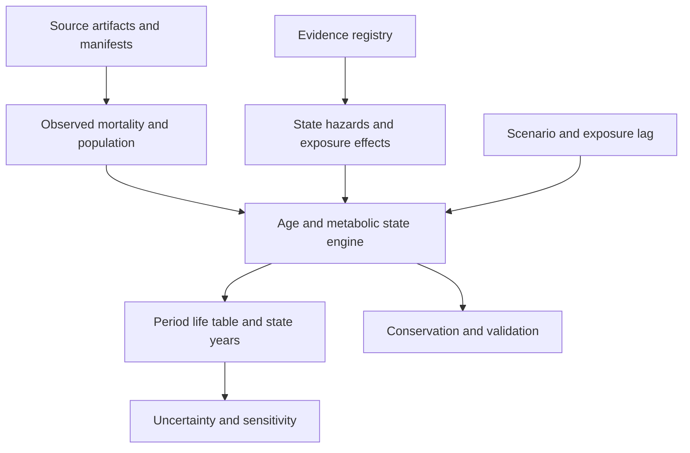

# Demeter

**Demeter is an open-source project from [Food is Health](https://foodishealth.substack.com/) to model the market dynamics connecting food, agriculture, health, and capital.**

The project translates questions explored in the Food is Health Substack into explicit causal relationships, auditable evidence, and reproducible scenarios. Its long-term purpose is to show where change can influence the system, what constrains that change, who benefits, and how strategic options gain or lose value as key trends shift.

Demeter is intended for **participants at every stage of the value chain** to see
how a change they make creates value elsewhere, and what allows them to capture
a share. For example, a producer adding a regenerative practice should be able
to investigate how its effects reach retail and how any added value flows back
through prices, costs, and contracts.

The flagship future exercise is a **shift toward real food**. It should reveal
the levers connecting agriculture, food, and health, with particular attention
to whether earlier intervention in the **PreChronic** population can reduce net
healthcare costs. See [the scenario brief](docs/REAL_FOOD_VALUE_CHAIN.md) for the
actors, pathways, required definitions, and evidence still needed.

The [model-design inputs](docs/design/README.md) turn that purpose into a
causal-loop table, positive/negative externality registers, required input
packages, and formulation/validation contracts. Proposed loops remain labeled
premises until their evidence, equations, and applicability are established.

Food prices, treatment access, consumer behavior, production costs, and reimbursement can change together. Demeter aims to trace those changes through food demand, supply, metabolic health, healthcare economics, and the incentives that feed back into the market. The model must be able to challenge a Food is Health hypothesis as well as support it.

**New here?** [Purpose and staged roadmap](docs/START_HERE.md) · [Install on macOS, Linux, or Windows](docs/GETTING_STARTED.md) · [First exercise](docs/FIRST_EXERCISE.md) · [Data and source archive](data/README.md) · [Contribute](CONTRIBUTING.md)

Think of Demeter as a **management flight simulator built in stages**: form a
hypothesis, try an intervention, inspect delays and consequences, and improve
your understanding. The learning approach is inspired by John Sterman and MIT's
[management flight simulators](https://mitsloan.mit.edu/faculty/academic-groups/system-dynamics/courses-and-programs).
Demeter is an independent project; the current health engine is the first stage
of that larger ambition. Each new mechanism must earn its place through evidence
and validation.

You can help before the whole system exists. Improve one source, test one causal
link, explain a real constraint, or tell us where a first-time reader gets lost.
The goal is progressively better analysis, including results that challenge the
Food is Health thesis. Current dietary scenario outputs remain **validation-only**.

**Explore further:** [Public guide](docs/wiki/Home.md) · [Levers and scenarios](docs/wiki/Levers-and-Scenarios.md) · [Real options](docs/wiki/Real-Options-and-Strategic-Value.md) · [Tornado diagrams](docs/wiki/Visualization-and-Tornado-Diagrams.md) · [Model status](docs/V0_1_STATUS.md)

## What Demeter is intended to reveal

| Question | Intended analysis |
| --- | --- |
| Which changes matter most? | Trace a controllable lever through adoption, substitution, delays, health effects, and economic feedback. |
| What prevents change? | Locate constraints in affordability, consumer persistence, evidence, reimbursement, supply, or capital. |
| What if a major trend changes? | Compare slow, fast, stalled, and reversing paths for food prices, GLP-1 access, prevention adoption, and production economics. |
| Who receives the value? | Separate health gains, household spending, payer savings, provider economics, farm income, and enterprise cash flows. |
| What is worth keeping open? | Compare committing now with piloting, waiting, expanding, switching, or exiting as new information arrives. |

For example, a producer and retailer could compare a pilot for a specified
regenerative product with committing to larger capacity. Demeter should eventually
show how repeat purchases, a possible premium, verification and distribution costs,
and procurement terms affect each party's return. Any health benefit requires its
own evidence; neither a practice label nor a retail premium establishes one.

These market and real-options capabilities are **planned research directions**. The current release establishes a narrower health-model foundation; it does not yet value businesses, forecast food markets, or estimate validated dietary health effects.

Tornado diagrams are a planned core diagnostic: rank how much specified changes in each input move an outcome, show direction and uncertainty ranges, and connect each bar to its causal path and evidence. Decision-focused versions should show which assumptions change the relative value of acting, waiting, expanding, or exiting. These charts describe model sensitivity; causal interpretation depends on the underlying evidence.

## An open project under Food is Health

The [Substack](https://foodishealth.substack.com/) is the home for the broader conversation. This repository is the home for inspectable code, evidence, assumptions, and model revisions. Readers, researchers, operators, clinicians, economists, and developers can help turn a thesis into a testable question, supply evidence, or identify a missing mechanism.

Demeter is released under the [MIT License](LICENSE). Contributions should preserve reproducibility, document uncertainty, and make disagreement testable. Anyone can propose a pull request; Carter Williams ([@jcarterwil](https://github.com/jcarterwil)) reviews and merges community changes. See [contributing](CONTRIBUTING.md) and [governance](GOVERNANCE.md).

## Project vision

The program vision and phased roadmap are documented in [docs/PROJECT_VISION.md](docs/PROJECT_VISION.md). The mature module/runtime architecture is in [docs/SYSTEM_ARCHITECTURE.md](docs/SYSTEM_ARCHITECTURE.md), and the long-term scenario surface is preserved in [docs/SCENARIO_CATALOG.md](docs/SCENARIO_CATALOG.md).

Demeter is designed as a hybrid system: system dynamics for aggregate stocks/flows and feedback loops, with agent-based modeling added selectively where heterogeneous behavior matters. Canonical naming is **Demeter** for the project/model, **Demeter Model** for the scientific model, and **Demeter Simulator** for the eventual interactive application. The scientific model remains locally reproducible; Codex Cloud is used for bounded autonomous engineering; Vercel is reserved for a later interactive interface rather than the core model runtime.

## North-star questions

Demeter is ultimately intended to identify **system leverage**: which upstream changes materially alter downstream health and economic outcomes, through what pathways, with what delays, feedbacks, and uncertainty.

Examples include:

- How does consumer price elasticity for higher-quality food affect dietary behavior and type 2 diabetes incidence?
- How do commodity-crop economics and processing scale create cheap calories relative to nutrient-dense food?
- How does nutrient density affect taste, satiety, food choice, and metabolic outcomes?
- Which links between agricultural practice, soil health, food composition, and chronic disease are strongly evidenced versus merely hypothesized?
- Under what conditions could regenerative or other production practices materially reduce chronic-disease burden?
- Which intervention points have the largest downstream impact per dollar, per acre, or per unit of behavioral change?
- Where do delays, reinforcing loops, balancing loops, and bottlenecks dominate the system?

These are research questions, not assumptions. Demeter should make the intermediate causal links explicit and allow the evidence and sensitivity analysis to determine which levers are material.

## Current status: v0.1.0a1 engineering build

The CLI and age-structured engine work with observed U.S. mortality and population inputs. **The scientific v0.1 release is not complete.** Metabolic-state allocation, transition hazards, mortality hazard ratios, dietary effect and lag still use clearly labeled synthetic inputs. The program refuses scientific mode until those gaps are resolved. No diet-induced lifespan result is a finding.

Implemented:

- 101 single-age/open-age cohorts (0–99, 100+), with total/male/female runs.
- CDC/NCHS 2022–2024 mortality schedules and Census Vintage 2025 age counts for those years.
- Three population-conserving metabolic states; explicit deaths, aging, and zero births/migration.
- Independent period life tables, plus a Sullivan-style measure of years in the modeled healthy state.
- Evidence registry, source checksums, dose-envelope checks, lags, and provenance on every simulation.
- Scenario comparison, paired Monte Carlo uncertainty, SALib Sobol sensitivity, prevalence discrepancy report, and historical mortality persistence backtest.

See [acceptance status](docs/V0_1_STATUS.md), [model specification](docs/MODEL_SPEC.md), and [evidence gaps](docs/EVIDENCE_GAPS.md).

## Run locally or in Codex Cloud

For a first installation, follow the [platform-specific setup guide](docs/GETTING_STARTED.md).
There is no server, database, API key, or paid tool to configure. uv uses the pinned
Python 3.12 environment; Python 3.11 is also exercised in CI. Once cloned, run from
the repository root:

```text
uv sync --locked
uv run demeter validate
uv run demeter observe scenarios/reduce_upf_30.yaml --draws 4 --samples 8 --seed 42
```

Open `outputs/observability/index.html`: use `open` on macOS, `xdg-open` on Linux,
or `Start-Process .\outputs\observability\index.html` in Windows PowerShell.
The small sample counts are for a first look at the tools. Continue with the
[guided exercise](docs/FIRST_EXERCISE.md).

Additional analysis and contributor commands:

```bash
uv sync --locked
uv run demeter validate
uv run demeter evidence audit
uv run demeter evidence applicability
uv run demeter simulate scenarios/baseline.yaml --output outputs/baseline.json
uv run demeter simulate scenarios/reduce_upf_30.yaml --output outputs/reduce_upf_30.json
uv run demeter compare scenarios/baseline.yaml scenarios/reduce_upf_30.yaml
uv run demeter uncertainty scenarios/reduce_upf_30.yaml --draws 128 --seed 42
uv run demeter sensitivity life_expectancy --samples 64 --seed 42
uv run demeter backtest --train-year 2022 --holdout-year 2023
uv run python -X utf8 -m pytest
uv run ruff check .
```

Commands emit readable JSON. Ordinary runs and tests are offline after installation. `validate` exits successfully when software/data checks pass, while reporting `scientific_release_ready: false`. `validate --scientific-required` deliberately exits with code 1 for this alpha.

For more stable Sobol estimates, increase `--samples` to 256 or 1024 and inspect the reported confidence half-widths. Small sample runs are tests of the analysis pipeline, not reliable rankings.

## Architecture



Core equations use transparent NumPy arrays. BPTK-Py remains available for later feedback/delay modules; the age-shift and life-table operations are easier to inspect directly. There is no database or hosted runtime dependency. See [the engine decision](docs/ENGINE_DECISION.md).

## Source data travel with the model

The repository contains the 13 small public source artifacts used by the current
baseline and historical pipelines, as well as the model-ready bundles. See the
[data catalog and contribution policy](data/README.md) for locations, source terms,
and the distinction between raw observations, derived inputs, and assumptions.
Verify the archive and reproduce both bundles without network access or changes
to committed files:

```bash
uv run python scripts/verify_source_archive.py --rebuild
```

Curated immutable source snapshots live in `data/sources/`. Scratch downloads in
`data/raw/` and generated results remain ignored. The existing `demeter data rebuild`
command is for intentional source-pipeline maintenance and writes the bundle;
beginners do not need it. A changed upstream file requires a reviewed source update.
Bundles and manifests live in `src/demeter/data/bundled/` and also ship in the wheel.

The manifest records exact URLs, retrieval times, publisher, vintage, hashes, transform, and output schema. Observed data families are registered in `evidence/parameters.yaml`. Public federal data are used; no personal health data are included.

## Interpret outputs correctly

- **Period life expectancy** is the result of freezing a mortality schedule. It is not a forecast of an individual's lifespan.
- **Metabolically healthy life expectancy** weights life-table person-years by the healthy-state prevalence. It is not general disability-free life expectancy or WHO HALE.
- **Parameter intervals** vary independent synthetic ranges. They omit uncertainty in the mortality/population inputs, model structure, and parameter correlations.
- **Closed population** means births and migration are zero. Census counts initialize the model; later counts are not U.S. demographic forecasts. Empty age cells use reference state shares for period calculations, and their number is reported.
- **UPF** is currently a relative exposure plumbing test. It has no validated causal dose-response mapping. Changing fiber or fruit/vegetable exposure is rejected to avoid adding unsupported correlated effects.
- **Prevalence checks** currently fail calibration/definition matching. CDC total diabetes and prediabetes cannot silently become T2D and all insulin resistance.
- **The historical backtest** carries 2022 mortality forward into 2023. It measures the error of a no-change mortality forecast. It does not validate dietary effects.

## Next scientific gate

Resolve state definitions and age-specific baseline prevalence, fit defensible transition hazards and mortality ratios, encode study-compatible dietary doses and uncertainty, and evaluate an independent historical health holdout. Until then, the software reports validation-only results and remains a prerelease. Agriculture, agent behavior, policy, economics, and a public simulator follow the phases in the program vision.

The [issue #1 audit](docs/ISSUE_1_AUDIT.md) records the remaining acceptance criteria.
Corrected ARIC and LEADR clinical estimates are registered as **benchmarks only**;
`demeter evidence applicability` shows why they cannot replace national model inputs.
See [clinical evidence extraction](docs/CLINICAL_EVIDENCE.md) for source receipts,
correction handling, reproducible table extraction, and transport limitations.
The original [post-v0.1 roadmap](docs/POST_V0_1_ROADMAP.md) and
[backtesting strategy](docs/BACKTESTING_STRATEGY.md) are preserved from the existing
documentation branch; their implementation remains subject to the scientific gates.

Historical observations and rolling-origin diagnostics are available offline:

```bash
uv run demeter historical-backtest --output outputs/historical-backtest.json
```

This covers 13 NCHS/NHIS/USDA series with explicit holdouts, residuals, empirical
forecast intervals and comparability breaks. It evaluates historical benchmarks;
it does not validate causal dietary effects. See [the historical contract](docs/HISTORICAL_BACKTESTS.md).

Generate the scientific observability report (34 interactive views, offline):

```bash
uv run demeter observe scenarios/reduce_upf_30.yaml --seed 42
```

Open `outputs/observability/index.html`. Saved diagnostics can be re-rendered
without running the model. See [observability](docs/OBSERVABILITY.md) and the
[exploration notebook](notebooks/observability.ipynb). Charts retain evidence
status and validation-only labels; they do not establish causal dietary effects.
