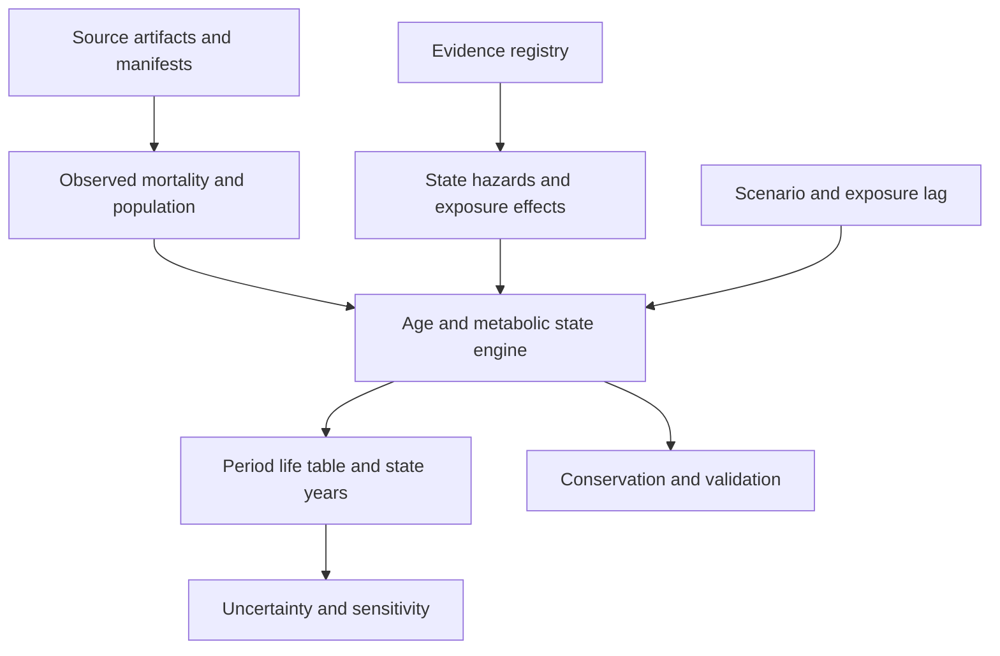

# Demeter

**Demeter is a systems model of food, health, agriculture, and longevity.**

The project is intended to make the Food is Health thesis computable: explicit causal relationships, auditable evidence, quantified uncertainty, reproducible scenarios, and traceable downstream effects across population health, agriculture, economics, and policy.

## Project vision

The program vision and phased roadmap are documented in [docs/PROJECT_VISION.md](docs/PROJECT_VISION.md). The recommended sequence after v0.1 is in [docs/POST_V0_1_ROADMAP.md](docs/POST_V0_1_ROADMAP.md), and the multi-decade validation protocol is in [docs/BACKTESTING_STRATEGY.md](docs/BACKTESTING_STRATEGY.md). The mature module/runtime architecture is in [docs/SYSTEM_ARCHITECTURE.md](docs/SYSTEM_ARCHITECTURE.md), and the long-term scenario surface is preserved in [docs/SCENARIO_CATALOG.md](docs/SCENARIO_CATALOG.md).

Demeter is designed as a hybrid system: system dynamics for aggregate stocks/flows and feedback loops, with agent-based modeling added selectively where heterogeneous behavior matters. Canonical naming is **Demeter** for the project/model, **Demeter Model** for the scientific model, and **Demeter Simulator** for the eventual interactive application. The scientific model remains locally reproducible; Codex Cloud is used for bounded autonomous engineering; Vercel is reserved for a later interactive interface rather than the core model runtime.

## North-star questions

Demeter is ultimately intended to identify **system leverage**: which upstream changes materially alter downstream health and economic outcomes, through what pathways, with what delays, feedbacks, and uncertainty.

Examples include:

- How does consumer price elasticity for higher-quality food affect dietary behavior and type 2 diabetes incidence?
- How do commodity-crop economics and processing scale create cheap calories relative to nutrient-dense food?
- How does nutrient density affect taste, satiety, food choice, and metabolic outcomes?
- Which links between agricultural practice, soil health, food composition, and chronic disease are strongly evidenced versus merely hypothesized?
- Under what conditions could regenerative or other production practices materially reduce chronic-disease burden?
- Which intervention points have the largest downstream impact per dollar, per acre, or per unit of behavioral change?
- Where do delays, reinforcing loops, balancing loops, and bottlenecks dominate the system?

These are research questions, not assumptions. Demeter should make the intermediate causal links explicit and allow the evidence and sensitivity analysis to determine which levers are material.

## Current status: v0.1.0a1 engineering build

The CLI and age-structured engine work with observed U.S. mortality and population inputs. **The scientific v0.1 release is not complete.** Metabolic-state allocation, transition hazards, mortality hazard ratios, dietary effect and lag still use clearly labeled synthetic inputs. The program refuses scientific mode until those gaps are resolved. No diet-induced lifespan result is a finding.

Implemented:

- 101 single-age/open-age cohorts (0–99, 100+), with total/male/female runs.
- CDC/NCHS 2022–2024 mortality schedules and Census Vintage 2025 age counts for those years.
- Three population-conserving metabolic states; explicit deaths, aging, and zero births/migration.
- Independent period life tables, plus a Sullivan-style measure of years in the modeled healthy state.
- Evidence registry, source checksums, dose-envelope checks, lags, and provenance on every simulation.
- Scenario comparison, paired Monte Carlo uncertainty, SALib Sobol sensitivity, prevalence discrepancy report, and historical mortality persistence backtest.

See [acceptance status](docs/V0_1_STATUS.md), [model specification](docs/MODEL_SPEC.md), and [evidence gaps](docs/EVIDENCE_GAPS.md).

## Run locally or in Codex Cloud

Use Python 3.11+ and [uv](https://docs.astral.sh/uv/). Run these commands from the repository root:

```bash
uv sync --locked
uv run demeter validate
uv run demeter evidence audit
uv run demeter simulate scenarios/baseline.yaml --output outputs/baseline.json
uv run demeter simulate scenarios/reduce_upf_30.yaml --output outputs/reduce_upf_30.json
uv run demeter compare scenarios/baseline.yaml scenarios/reduce_upf_30.yaml
uv run demeter uncertainty scenarios/reduce_upf_30.yaml --draws 128 --seed 42
uv run demeter sensitivity life_expectancy --samples 64 --seed 42
uv run demeter backtest --train-year 2022 --holdout-year 2023
uv run pytest
uv run ruff check .
```

Commands emit readable JSON. Ordinary runs and tests are offline after installation. `validate` exits successfully when software/data checks pass, while reporting `scientific_release_ready: false`. `validate --scientific-required` deliberately exits with code 1 for this alpha.

For more stable Sobol estimates, increase `--samples` to 256 or 1024 and inspect the reported confidence half-widths. Small sample runs are tests of the analysis pipeline, not reliable rankings.

## Architecture



Core equations use transparent NumPy arrays. BPTK-Py remains available for later feedback/delay modules; the age-shift and life-table operations are easier to inspect directly. There is no database or hosted runtime dependency. See [the engine decision](docs/ENGINE_DECISION.md).

## Rebuild source data

```bash
uv run demeter data rebuild --raw data/raw
```

This downloads official Excel/CSV artifacts if absent and verifies pinned checksums before rebuilding the committed small offline bundle. A changed upstream file causes a failure requiring a reviewed source update. Raw files are ignored by Git. The bundle and its manifest live in `src/demeter/data/bundled/`, so the model also works from a built wheel.

The manifest records exact URLs, retrieval times, publisher, vintage, hashes, transform, and output schema. Observed data families are registered in `evidence/parameters.yaml`. Public federal data are used; no personal health data are included.

## Interpret outputs correctly

- **Period life expectancy** is the result of freezing a mortality schedule. It is not a forecast of an individual's lifespan.
- **Metabolically healthy life expectancy** weights life-table person-years by the healthy-state prevalence. It is not general disability-free life expectancy or WHO HALE.
- **Parameter intervals** vary independent synthetic ranges. They omit uncertainty in the mortality/population inputs, model structure, and parameter correlations.
- **Closed population** means births and migration are zero. Census counts initialize the model; later counts are not U.S. demographic forecasts. Empty age cells use reference state shares for period calculations, and their number is reported.
- **UPF** is currently a relative exposure plumbing test. It has no validated causal dose-response mapping. Changing fiber or fruit/vegetable exposure is rejected to avoid adding unsupported correlated effects.
- **Prevalence checks** currently fail calibration/definition matching. CDC total diabetes and prediabetes cannot silently become T2D and all insulin resistance.
- **The historical backtest** carries 2022 mortality forward into 2023. It measures the error of a no-change mortality forecast. It does not validate dietary effects.

## Next scientific gate

Resolve state definitions and age-specific baseline prevalence, fit defensible transition hazards and mortality ratios, encode study-compatible dietary doses and uncertainty, and evaluate an independent historical health holdout. Until then, the software reports validation-only results and remains a prerelease. Agriculture, agent behavior, policy, economics, and a public simulator follow the phases in the program vision.
