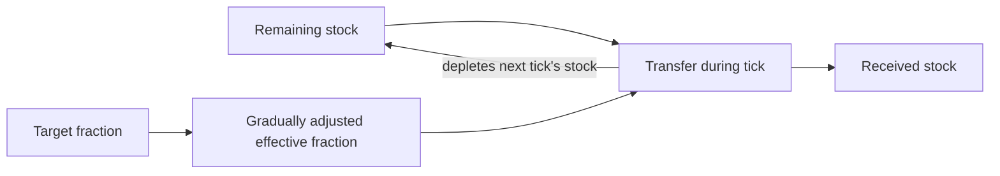

# Learn Demeter in ten steps

This is a reproducible software lesson for a technically curious reader. Complete
[installation](GETTING_STARTED.md) first and run commands from the checkout root.
The model's dietary effects remain **validation-only**. Calibration is a separate
reviewed exercise; nothing here fits the health model or changes its evidence.

You can follow the CLI recipes below or run the companion
[notebook](../notebooks/learning_path.ipynb). To execute every notebook cell and
its expected-result checks without installing a notebook server:

```text
uv run python scripts/run_learning_notebook.py
```

It writes `outputs/tutorial/`, including a report, scenario, evidence excerpts
and `checks.json`. A successful run ends with `all lesson assertions passed`.
Re-running replaces generated files in that destination. Use `--destination`
to retain separate runs. In an existing Jupyter editor, select the checkout's
`.venv` Python kernel and run all cells from the repo or `notebooks` directory.
The headless command checks Python execution; it does not test a Jupyter UI.

## A small model before the health model

```text
uv run python -m demeter.examples.stock_flow --output outputs/tutorial/toy.json
```

Imagine two containers of abstract tokens. **Stocks** count tokens at boundaries;
a **flow** counts tokens moved over an interval. Remaining plus received must
always equal the initial endowment. The step is one abstract tick, not a year.
No person, disease, farm or price is represented.



The registry supplies `toy_initial_tokens = 100`, `toy_target_fraction = 0.25`
and `toy_response_fraction = 0.5`. They are synthetic, grade E, and marked
`benchmark_only` to exclude them from health inputs. Initial received stock and
effective fraction are zero by definition. Before each tick's transfer:

```text
effective = effective + response * (target - effective)
transfer = remaining * effective
remaining = remaining - transfer
received = received + transfer
```

Predict the first two steps, then check:

| Boundary | Effective fraction | Transfer in preceding tick | Remaining | Received |
| --- | ---: | ---: | ---: | ---: |
| 0 | 0 | 0 | 100 | 0 |
| 1 | 0.125 | 12.5 | 87.5 | 12.5 |
| 2 | 0.1875 | 16.40625 | 71.09375 | 28.90625 |

These exact numbers check arithmetic, not empirical precision. The initial row's
zero flow is a placeholder for no preceding interval. Fractions are bounded
between zero and one; they are discrete transfer fractions, not hazards.

**Feedback:** at a fixed fraction, a larger transfer leaves less stock for the
next transfer, a balancing loop. **Delay:** response below one closes only part
of the gap to the target at each tick. Growing response can initially outweigh
depletion, so flow need not decline immediately. In the notebook, compare instant
response and zero transfer, then the target's registered range endpoints.
Those endpoints are invented sensitivity cases, not confidence bounds.

Read the [implementation](../src/demeter/examples/stock_flow.py) and
[scope/equation record](rfcs/0019-teaching-model.md). This standalone example
does not change the health engine or its uncertainty sampling.

## 1–3. Install, run the baseline, inspect the graph

After [setup](GETTING_STARTED.md), run:

```text
uv run demeter validate
uv run demeter simulate scenarios/baseline.yaml --output outputs/tutorial/baseline.json
uv run demeter observe scenarios/reduce_upf_30.yaml --draws 4 --samples 8 --seed 42 --destination outputs/tutorial/report
```

Expected: software checks pass while `scientific_release_ready` remains false;
the baseline has 26 annual boundaries (initial plus 25 years) and 101 age cells.
Ending living population plus deaths equals starting population within floating
point tolerance. There are no births or migration in these scenarios.

Open `outputs/tutorial/report/index.html`:

| Platform | Command |
| --- | --- |
| Windows PowerShell | `Start-Process .\outputs\tutorial\report\index.html` |
| macOS | `open outputs/tutorial/report/index.html` |
| Linux desktop | `xdg-open outputs/tutorial/report/index.html` |

Inspect health stocks, annual flows and the dependency graph. Hover on a link to
inspect its equation/evidence. Dashed amber links depend on synthetic evidence.
A graph is a map of implemented dependencies, not proof of causal identification.
The HTML works offline. Its neighboring `diagnostics.json` preserves the inputs
and diagnostics used to render it.

## 4–5. Change a scenario and compare uncertainty

Read `scenarios/baseline.yaml` and `scenarios/reduce_upf_30.yaml`. The latter
changes relative UPF exposure from 1.0 to 0.7, not to 70% of dietary energy.
State your prediction before running:

```text
uv run demeter compare scenarios/baseline.yaml scenarios/reduce_upf_30.yaml --output outputs/tutorial/comparison.json
uv run demeter uncertainty scenarios/reduce_upf_30.yaml --draws 4 --seed 42 --output outputs/tutorial/uncertainty.json
```

Inspect `outcomes.life_expectancy.absolute_delta` (years) alongside
`relative_delta` (a fraction). Read `paired_deltas` in the uncertainty output.
Both scenarios in a pair share a parameter draw, which isolates their difference.
Four draws are only a smoke test. Their quantiles are not reliable uncertainty
estimates; more draws do not fix unsupported distributions or omitted mechanisms.

Period life expectancy freezes a mortality schedule. It is not the predicted
lifespan of a cohort. The modeled healthy-state metric is also not overall HALE.
Do not interpret these synthetic changes as dietary recommendations or findings.

## 6. Inspect the evidence behind one link

```text
uv run demeter evidence audit
uv run demeter evidence applicability --output outputs/tutorial/applicability.json
```

Find `beta_upf_progression` in `evidence/parameters.yaml`: status `synthetic`,
grade E, with a development uncertainty range. Contrast it with
`aric_hba1c_prediabetes_diabetes_incidence`: a source-linked clinical candidate
whose `applicability.blockers` explain why it cannot replace the active hazard.
Observed association, causal strength and transportability are separate questions.
The notebook writes these two records to `evidence-example.json` for inspection.

Source data are already archived with reload recipes and official links; see
[dataset storage](../data/README.md) and [source notices](../data/NOTICE.md).
Ordinary lessons require no live publisher request. Missing or changed source
bytes must be reported, never replaced with invented values.

## 7–8. Sensitivity and a historical backtest

```text
uv run demeter sensitivity life_expectancy --scenario scenarios/reduce_upf_30.yaml --samples 8 --seed 42 --output outputs/tutorial/sensitivity.json
uv run demeter backtest --train-year 2022 --holdout-year 2023
uv run demeter historical-backtest --output outputs/tutorial/historical.json
```

Sensitivity asks which assumptions contribute to variation under the chosen
distributions. Eight base samples exercise the Sobol code but cannot establish
stable rankings. Historical diagnostics expose residuals, fold roles and coverage;
a failed comparison is useful information, not a reason to retune a holdout.

The short backtest predicts using only the 2022 mortality schedule. Expected
`holdout_used_in_prediction` and `scientific_validation_of_diet` are both false.
The longer command includes rolling observational benchmarks. Neither command
calibrates clinical transition parameters or establishes dietary causality.

**Calibration** selects or fits parameters against defined observations.
**Validation** tests whether the resulting model behaves adequately for a stated
purpose, including independent holdouts where appropriate. Conservation tests
check implementation; they cannot establish a causal relationship. The baseline
already reconciles its mortality mixture to a source life table; completing the
broader scientific calibration requires aligned clinical observations, uncertainty,
and a predeclared holdout plan. That work remains deferred.

## 9. Create a new scenario

Copy `scenarios/reduce_upf_30.yaml` to `outputs/tutorial/control.yaml` (create
the destination folder first if you skipped the earlier commands). In PowerShell:

```powershell
Copy-Item scenarios/reduce_upf_30.yaml outputs/tutorial/control.yaml
```

On macOS/Linux, use `cp` instead of `Copy-Item`. Edit the copy: set `name` to
`learning_control`, describe the control, and set `exposures.upf` to `1.0`.
Keep the horizon, year, sex and other settings unchanged. Then run:

```text
uv run demeter compare scenarios/baseline.yaml outputs/tutorial/control.yaml --output outputs/tutorial/control-comparison.json
```

Expected: every `absolute_delta` is exactly zero. The notebook creates and reloads
the same control automatically. Start from this control to try another supported
exposure, preserving each experiment's YAML. Parser errors identify unsupported
fields; do not bypass the evidence envelope to make a scenario run silently.

## 10. Add a simple custom module

Read [the small module template](../examples/tutorial_module.py). It declares
its inherited input/output ports and parameter dependencies in `describe`, and
supplies baseline hazards in `hazards`. Its deliberate structural null ignores
dietary modifiers. Copy it to `examples/my_module.py`:

```powershell
Copy-Item examples/tutorial_module.py examples/my_module.py
```

Use `cp` on macOS/Linux. Change `module_id` to `learner.my_null`, keeping the class
name `LearningNull`. Run from the checkout root, using `python -m` so the local
`examples` namespace is importable without installing a separate package:

```text
uv run python -m demeter.cli simulate scenarios/reduce_upf_30.yaml --transition-module examples.my_module:LearningNull --output outputs/tutorial/my-module.json
```

Expected: final cohorts match the canonical baseline, and module provenance
records the factory, specification and Python source hash. The notebook and tests
check this equality for the template. This demonstrates adding a local module,
not evidence that diet has no clinical effect. Keep the source file with the run;
classes defined only in notebook cells cannot supply file provenance.

The engine still owns mortality, age progression and population accounting.
New coefficients belong in the registry, never hidden constants in `hazards`.
New scientific mechanisms follow the [scientific review process](SCIENTIFIC_REVIEW.md).
See [module contracts](MODULE_API.md) before changing units, ports or equations.
Custom modules currently run through library/`simulate`; the CLI uncertainty,
sensitivity and observability commands use the canonical model.

## Keep a reproducible record

Save `git rev-parse HEAD`, `uv.lock`, scenario YAML, module source, registry/hash,
command, seed and generated outputs. The notebook's `checks.json` records exact
toy checks, age-cell count, control/module equality and `calibration_performed:
false`. CI executes every code cell in a fresh destination on the supported
platforms; there are no precomputed notebook outputs to mistake for a new run.

Record what you expected, what happened and which observation could reject the
mechanism. Continue with the [first exercise's debrief](FIRST_EXERCISE.md),
[model specification](MODEL_SPEC.md), or [contribution guide](../CONTRIBUTING.md).
