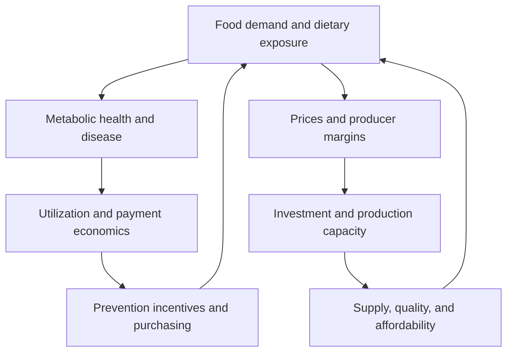

# Modeling Food is Health market dynamics

Demeter's long-term unit of analysis is a connected system: households, food companies, farms, clinicians, providers, payers, employers, and capital providers responding to each other over time. This page describes the intended model, beyond the current health-only prerelease.

## From macro change to market response

A scenario begins with explicit changes in conditions: relative food prices, household budgets, treatment access, production technology, payment rules, or preferences. It follows those changes through behavior and physical capacity before calculating health or economic outcomes.

The model should distinguish **external drivers** from **endogenous responses**. A scenario may impose an input-cost shock; retail prices, substitution, investment, and later supply should then respond through documented equations. Imposing both a demand increase and its presumed price outcome can otherwise count the same assumption twice.

These are candidate causal connections. Each implemented connection needs an operational definition, evidence, uncertainty, and a delay where relevant.

## Stocks make timing consequential

Stocks accumulate past decisions. Their adjustment speeds can differ substantially, so a near-term demand change need not produce an immediate health or supply response.

| Stock or persistent state | Flows or changes to represent | Timing question |
| --- | --- | --- |
| Population by age and metabolic state | Progression, recovery where supported, aging, mortality | When does a changed exposure affect incidence and later utilization? |
| Consumer habits and treatment participation | Adoption, persistence, discontinuation, substitution | Does initial uptake become sustained behavior? |
| Processing and distribution capacity | Investment, commissioning, utilization, retirement | Can supply respond before scarcity raises prices? |
| Agricultural land and soil conditions | Crop switching, practice adoption, soil change | How do transition risk and biological delays affect supply? |
| Provider capacity and payment contracts | Hiring, service changes, contract renewal, asset retirement | How fast can costs and incentives adjust to changed utilization? |

The current engine implements population aging and health-state mechanics. The other stocks above describe future modules.

## Feedback can amplify or limit a lever

### Affordability and scale

A proposed mechanism is that lower relative prices increase demand for a food category, larger volumes support investment, and scale reduces unit costs. A competing mechanism is that constrained supply raises prices before capacity arrives. The scenario should test both, including pass-through, spoilage, distribution, and household substitution.

The relevant measure is the price of an accessible, acceptable food basket relative to household resources. A cheaper ingredient has little effect if convenience, preparation time, availability, or taste prevents adoption.

### Prevention and payment incentives

An effective intervention could reduce later disease-related utilization. Whether that supports more prevention depends on who pays today, who receives later savings, the contract, and participant retention. A payer that loses members before benefits arrive faces a different decision from an organization responsible for long-term outcomes.

For a provider, lower utilization changes revenue and costs separately. Fixed costs may persist, spare capacity may be used for other care, and new prevention services may create revenue. The model must represent these responses before translating health improvement into provider financial outcomes.

### Demand and agricultural adjustment

Changing food demand can alter producer margins and investment incentives. Acreage, skills, equipment, offtake agreements, financing, and processing access can constrain the response. Production practices should affect health only through evidenced intermediate mechanisms such as composition, price, exposure, and actual consumption. A practice label alone is insufficient.

## Value created and value captured

Demeter should report outcomes by actor and time period. Combining all benefits into one headline number can hide the incentive problem.

This is central to the intended use of the model: each element of the value chain
should see the value added by system changes and how it could capture a share.
The [flagship real-food scenario](../REAL_FOOD_VALUE_CHAIN.md) follows a regenerative
production feature through retail economics and back through procurement terms
to producer returns. It separately examines the PreChronic health and healthcare-cost
pathway. The links between commercial and health value must be made explicit.

| Perspective | Outcomes to keep distinct |
| --- | --- |
| Individual or household | Health, out-of-pocket spending, food spending, time, access, and burden of participation. |
| Payer or employer | Intervention cost, eligible utilization changes, retention, payment obligations, and timing. |
| Provider | Volume, revenue, contribution margin, fixed costs, replacement activity, and capacity. |
| Farmer or food company | Price, volume, yield, input costs, capital needs, working capital, and margins. |
| Distributor, retailer, or food-service operator | Delivered cost, availability, assortment, repeat purchases, substitution, spoilage, and retained margin. |
| Public sector | Program costs, fiscal effects, population outcomes, and distribution across groups. |
| Enterprise or investor | Contractual share of value, competitive response, capital requirements, and risk. |

A payment can be a cost to one actor and revenue to another. Report those transfers without counting them twice as additional social value. Health gains, budget savings, and enterprise cash flows also require different metrics; they are not interchangeable.

## What an eventual result should show

For a specified scenario, a useful report would show the causal pathway; outcomes over time; effects by cohort and actor; binding constraints; uncertainty and alternative structures; and the assumptions that would reverse the result. Historical reconstruction and holdouts should test modules as they become available.

The scientific model provides these conditional system outcomes. A separate decision layer can then evaluate the [strategic choices](Real-Options-and-Strategic-Value.md) available to a particular actor.

See the [canonical architecture](https://github.com/Crusonia/Demeter/blob/main/docs/SYSTEM_ARCHITECTURE.md) and [project vision](https://github.com/Crusonia/Demeter/blob/main/docs/PROJECT_VISION.md).
